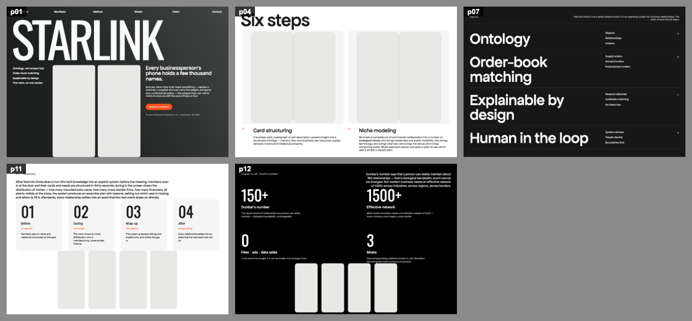
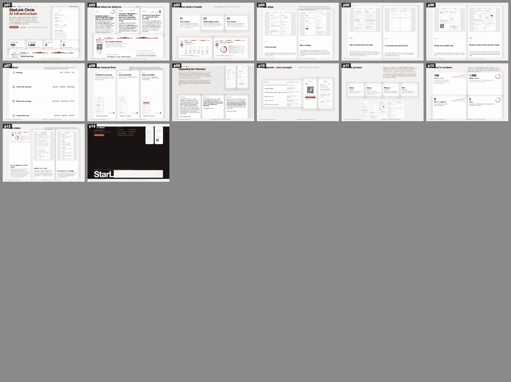
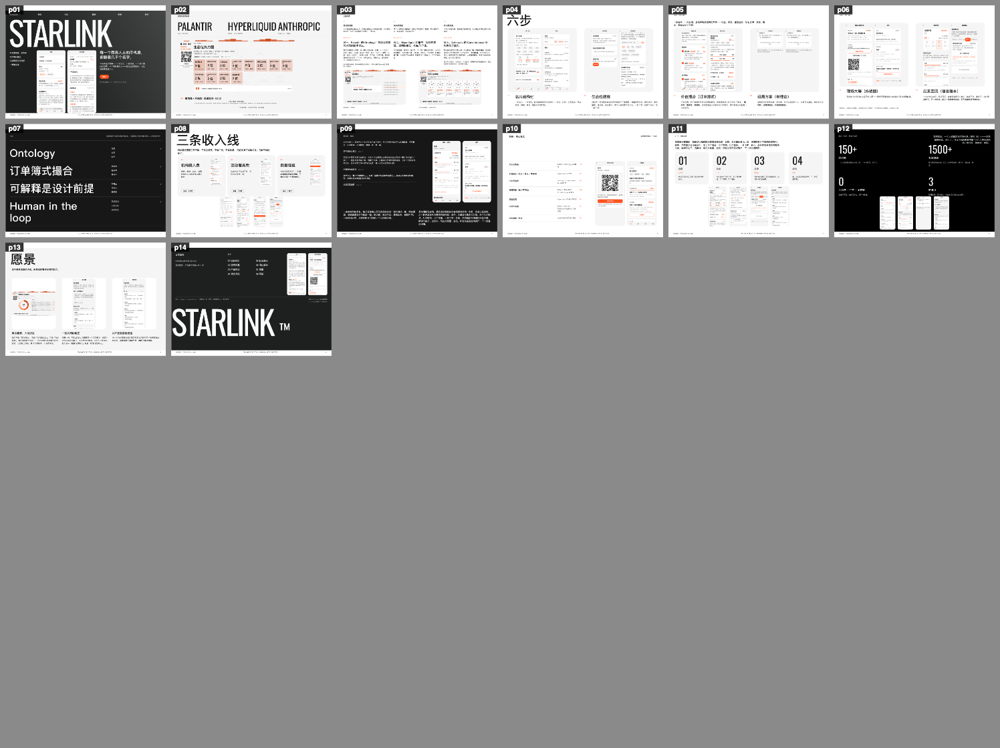
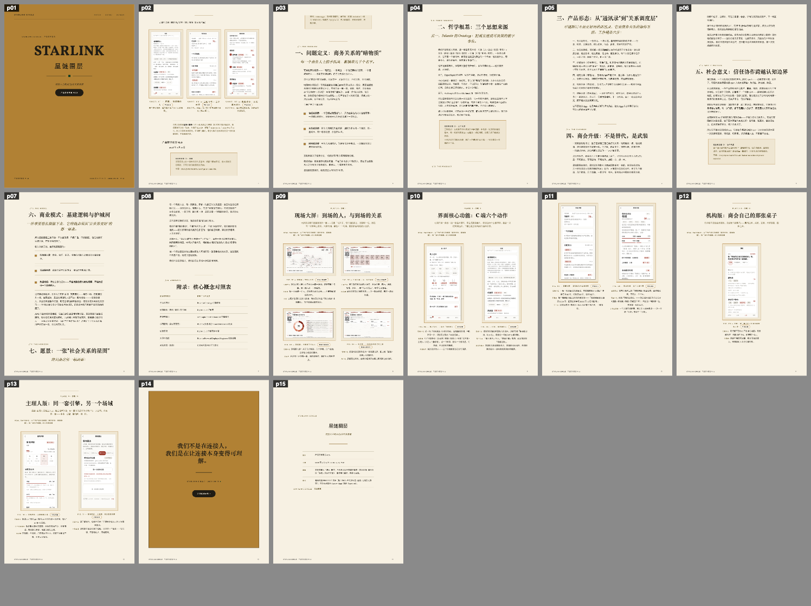
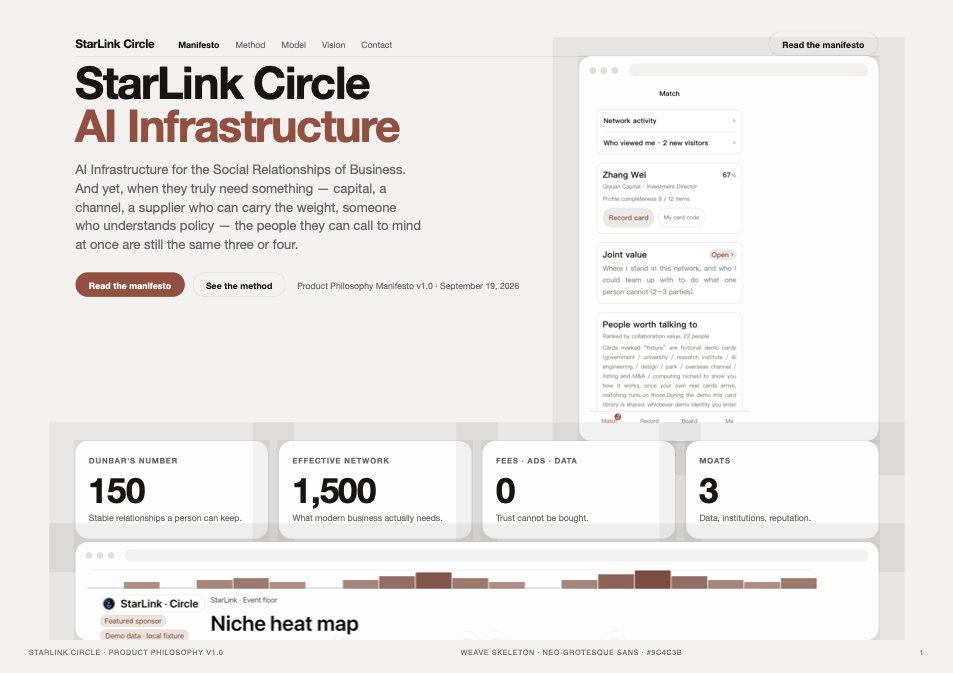
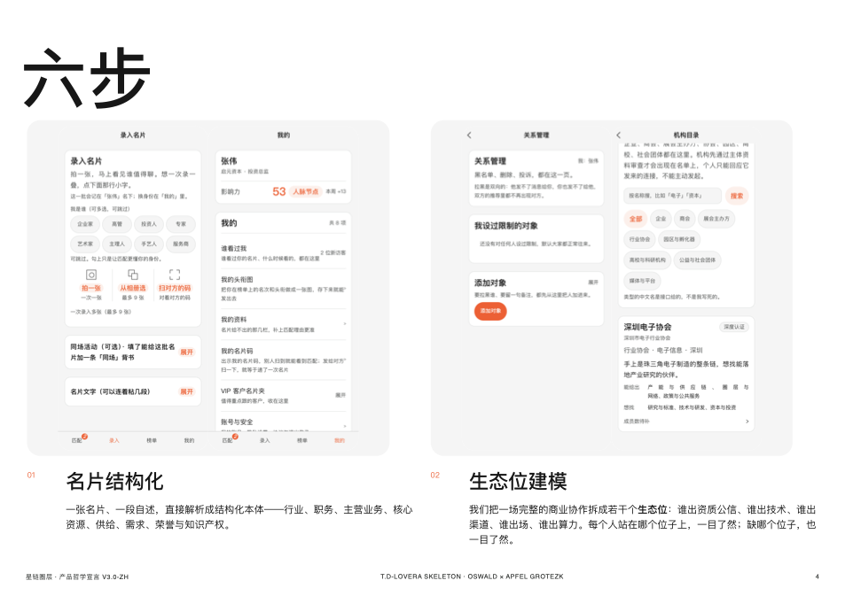

# style-distill · 把喜欢的风格，变成你自己的语言

**丢给它一个网站模版链接，它还你一套能留下的设计语言。**

Framer / Webflow 模版页、落地页画廊条目（比如
[`land-book.com/websites/98533-last-studio`](https://land-book.com/websites/98533-last-studio-A-agency-template-for-framer)）
都可以；也可以直接丢一份文档给它，再说一句中文还是英文。

我是 Lucy。深圳长大，学过建筑设计，现在在香港一家美国上市公司（持牌券商）做金融。
INTP，想得太多，热爱艺术、哲学和科技；业余时间就学点前沿的东西（最近是 AI），
以及和那些「想法很酷」的人聊天。

这个 skill，是被一件我绕不过去的烦心事逼出来的。

---

## 一个故事

我在做自己的应用小程序。内容想清楚了，故事也想清楚了，
手上还有一整个文件夹我真心喜欢的设计参考——有落地页，有一幅画，
有一份 PDF，它的版面比例一打开就让人觉得「对」。

我找不到的，是一个**能把我欣赏的设计变成我能反复使用的东西**的 skill。
不是「灵感」，不是情绪板，而是一套规则：能套到我自己的文字和我自己的截图上，
中文能用，英文也能用，一次不行就再来一次。

我试过的每个工具，最后都塞给我一个模版。
可是**模版是别人的答案。我要的不是答案，是语法。**

于是我不找了，自己做一个。

做完就是这个 `style-distill`：你给它一个**设计源**——最常见的是一条模版链接，
也可以是网址、PDF、截图、一幅画——它不「参考」它，它**量**它；
量完把它铸成一个可复用的技能，再把你的内容装进去；
最后还要查一遍：产出跟原风格到底是不是双胞胎。

五种设计语言，同一份手稿——[`examples/`](examples/) 里那几份都是这个 skill 出的。
这就是它的全部意思：**源可以换，文字永远是你自己的。**

---

## 它到底量什么

指纹里的每个数字都来自仪器，不来自感觉：

| 量什么 | 用什么量 |
| --- | --- |
| 调色板**和每个色占多大面积** | 渲染后的像素做 k‑means / 直接读 computed style |
| 版式骨架、网格栏数、块的顺序 | DOM 几何；源只有图时用像素带反推 |
| 字号阶梯、行高、字距 | computed style；只有截图时用行高剖面反推 |
| 图像策略、首图比例、留白率 | 像素统计 |
| 工艺（画作源）：笔触能量、线条语言、边硬度 | 像素代理量 |

然后**六道门禁**判断产出跟源是不是双胞胎：
主色承接 · 色相分布 · 明度分布 · 字号阶梯 · 栏数一致 · 图像策略。

过不了就说没过，连数字带原因一起写清楚——包括**门禁的假设本身对不上这个源**的时候。
**这里的每一项都不是靠感觉评的。**

---

## 案例：同一份手稿，五种设计语言

| | |
| --- | --- |
|  |  |
| **T.D-Lovera**（英文）——深色带、窄体大标题、橙色点缀 | **Weave**（英文）——浅灰底、圆角白卡、赭红点缀、数据图表 |
|  |  |
| **T.D-Lovera**（中文）——骨架不动，换系统中文字族、重调行距 | **克里姆特《吻》**——源是一幅画不是网站：金箔、母题、它自己的色彩比例 |

单页看得更清楚：

| | |
| --- | --- |
|  |  |

更多说明见 [`examples/README.md`](examples/README.md)。

---

## 它怎么工作

```
READ  →  EXTRACT  →  MINT  →  VERIFY
```

1. **READ** —— 先判源的类型，动手前写清一行设计意图。
2. **EXTRACT** —— 量。活体页面读 computed style；截图和画作走像素；
   站点被 Cloudflare 拦就借浏览器，实在不行退到代管截图，**量不到的字段标 unverified**。
3. **MINT** —— 把指纹铸成技能包：数值规则 + 设计令牌 + 双胞胎骨架。**这个包才是能复用的资产。**
4. **VERIFY** —— 拿六道门禁跟源比。不达标就回去改两条主梁，直到过；过不了就照实说为什么。

**两根主梁，顺序不能反**：先是构图（东西放哪、多大、留多少白），再是色彩
（什么颜色、**各占多大面积**）。其余的排印、图案、质感、素材、多语言，都服从这两条。
顺序反了，字再准也不像。

---

## 上手

```bash
# 1）把技能放进你的 agent
cp -r style-distill <your-agent>/agent_state/skills/

# 2）需要 Node 18+ 和 playwright-core（自带 Chromium）
npm i -g playwright-core

# 3）量一个源
node scripts/dna-probe.mjs https://example.com      --out dna.json --shot source.png
node scripts/dna-probe.mjs ./my-painting.jpg        --out dna.json      # 图片源

# 4）铸成技能
node scripts/mint-skill.mjs --dna dna.json --name design-example --title "Example" --out skills/design-example

# 5）验双胞胎
node scripts/dna-probe.mjs ./output.html --out twin.json --shot twin.png
node scripts/dna-probe.mjs --compare dna.json twin.json     # 退出码 0 = twin
```

然后就直接跟你的 agent 说：

> 「用这条模版链接 `<模版链接>` 的风格帮我出一份 PDF，内容在这儿，中文。」

模版链接可以从 `land-book.com`、Framer / Webflow 模版页、Behance 作品页上拿，
PDF、截图、画作一样收；最后告诉它**中文**还是 **English**。
源要是不配合（403、Cloudflare、登录墙），它会直说，然后走位图路线——
不会编数字出来。

细节见 `INSTALL.md`；没有 agent 框架也能用，直接读技能正文即可。

---

## 源不配合的时候

真实的源都很脏，所以这些经验**写在文档里，而不是埋在代码里**：
[`references/`](references/) 里有对付反爬和 403 的配方、只有截图时的位图路线、
缺图占位策略、多语言下不动文案原意的做法，以及把上传图形收编进风格而不变形的规矩。

几条踩出来的，故意留在库里：

- 设计聚合站自己 403 时，**它代管的那张截图的文件名往往就是真站域名**——量真站，别量壳。
- 模版本来是浅灰底白卡，你要是把页做成白底，**卡片就消失了**——页底必须铺源的主底色。
- 嵌套数组直接 join 进 HTML 会漏逗号，而 **grid 里的逗号会变成匿名网格项**，把第三张卡挤到第二行。
- 门禁不过时，先拿**源自己**去跑同一道门禁。有些门槛假设的东西，源从来就不是。

---

## 给谁用

给所有「做出来的东西必须看起来有人在乎」的人：
写给投资人的创始人、写产品哲学的团队、想要一套自家语言而不是套模版的设计师，
以及所有想过「为什么我不能指着这个说『就照它做』」的人。

只想抄语法，也很欢迎。

---

## 来聊

有看中的网站模版链接，或者一份文档，直接丢给它，再说一句中文还是英文，它不会让你失望。

也很想知道你用它做了什么，还知道它在哪儿翻车。

**微信：`Lucy_2025V`**

---

## 许可

MIT，见 [LICENSE](LICENSE)。
`examples/` 里的样张来自我自己的产品文档，放出来是为了让你看清这个 skill 能出什么；
其中的设计语言属于各自的源，本仓库**不搬运任何源站的内容**（文案、图片、Logo、吉祥物都没有）。
